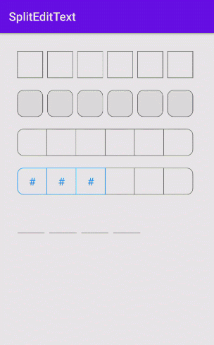

# SplitEditText

[](https://raw.githubusercontent.com/jenly1314/SplitEditText/master/app/release/app-release.apk)
[](https://bintray.com/beta/#/jenly/maven/splitedittext)
[](https://jitpack.io/#jenly1314/SplitEditText)
[](https://travis-ci.org/jenly1314/SplitEditText)
[](https://circleci.com/gh/jenly1314/SplitEditText)
[](https://android-arsenal.com/api?level=16)
[](https://opensource.org/licenses/mit-license.php)
[](https://jenly1314.github.io/)
[](http://shang.qq.com/wpa/qunwpa?idkey=8fcc6a2f88552ea44b1411582c94fd124f7bb3ec227e2a400dbbfaad3dc2f5ad)

SplitEditText for Android 是一个灵活的分割编辑框。常常应用于 **验证码输入** 、**密码输入** 、等场景。

> 之所以造这个轮子，是因为之前有这样的需求，然后也用过其他开发者类似的库，但是需求随着需求的变动，之前使用的库就不太满足现有的需求。所以最近抽空写了一个。

> 这里贴出之前使用过的轮子[VerificationCodeView](https://github.com/JackTuoTuo/VerificationCodeView)，他是通过继承 **RelativeLayout** 实现的，而 **SplitEditText** 通过继承 **AppCompatEditText** 实现，在使用和实现来说：更灵活，更优雅。

## 特性说明
- [x] 支持设置框数量
- [x] 支持设置框的风格样式
- [x] 支持根据状态区分框颜色
- [x] 基于EditText实现，更优雅

## Gif 展示


## SplitEditText 自定义属性说明
| 属性 | 值类型 | 默认值 | 说明 |
| :------| :------ | :------ | :------ |
| setStrokeWidth | dimension | 1dp | 画笔描边的宽度 |
| setBorderColor | color |<font color=#666666>#FF666666</font>| 边框颜色 |
| setInputBorderColor | color |<font color=#1E90FF>#FF1E90FF</font>| 已输入文本的边框颜色 |
| setFocusBorderColor | color | | 焦点框的边框颜色 |
| setBoxBackgroundColor | color | | 框的背景颜色 |
| setBorderCornerRadius | dimension | 0dp | 框的圆角大小（当 **BorderSpacing** 为 **0dp** 时，只有最左和最右两端的框有圆角） |
| setBorderSpacing | dimension | 8dp | 框与框之间的间距大小 |
| setMaxLength | integer | 6 | 允许输入的最大长度（框个数量） |
| setBorderStyle | enum | box | 边框风格 |
| setTextStyle | enum | plain_text | 文本风格（可以是明文或者密文，默认：明文） |
| setCipherMask | string | * | 密文掩码（当 **TextStyle** 为密文时，可自定义密文掩码） |
| setFakeBoldText | boolean | false | 是否是粗体 |


## 引入

### Maven：
```maven
<dependency>
  <groupId>com.king.view</groupId>
  <artifactId>splitedittext</artifactId>
  <version>1.0.0</version>
  <type>pom</type>
</dependency>
```
### Gradle:
```gradle
//AndroidX
implementation 'com.king.view:splitedittext:1.0.0'
```

### Lvy:
```lvy
<dependency org='com.king.view' name='splitedittext' rev='1.0.0'>
  <artifact name='$AID' ext='pom'></artifact>
</dependency>
```

###### 如果Gradle出现compile失败的情况，可以在Project的build.gradle里面添加如下：（也可以使用上面的GitPack来complie）
```gradle
allprojects {
    repositories {
        maven { url 'https://dl.bintray.com/jenly/maven' }
    }
}
```

## 示例

布局示例
```Xml
    <com.king.view.splitedittext.SplitEditText
        android:id="@+id/splitEditText"
        android:layout_width="match_parent"
        android:layout_height="45dp"
        android:inputType="number"/>
```

代码示例

Kotlin
```kotlin
    //设置监听
    splitEditText.setOnTextInputListener(object : SplitEditText.OnTextInputListener {
        override fun onTextInputChanged(text: String, length: Int) {
            //TODO 文本输入改变
        }

        override fun onTextInputCompleted(text: String) {
            //TODO 文本输入完成
        }

    })

```

Java
```java
    //设置监听
    splitEditText.setOnTextInputListener(new SplitEditText.OnTextInputListener(){

        @Override
        public void onTextInputChanged(String text, int length) {
            //TODO 文本输入改变
        }

        @Override
        public void onTextInputCompleted(String text) {
            //TODO 文本输入完成
        }
    });

```


更多使用详情，请查看[app](app)中的源码使用示例

## 相关推荐

[KingKeyboard](https://github.com/jenly1314/KingKeyboard) 自定义键盘，满足各种不同场景的键盘输入需求

## 版本记录

#### v1.0.0：2021-1-5
*  SplitEditText初始版本

## 赞赏
如果您喜欢SplitEditText，或感觉SplitEditText帮助到了您，可以点右上角“Star”支持一下，您的支持就是我的动力，谢谢 :smiley:<p>
您也可以扫描下面的二维码，请作者喝杯咖啡 :coffee:
    <div>
        
        
        
        
    </div>

## 关于我
   Name: <a title="关于作者" href="https://about.me/jenly1314" target="_blank">Jenly</a>

   Email: <a title="欢迎邮件与我交流" href="mailto:jenly1314@gmail.com" target="_blank">jenly1314#gmail.com</a> / <a title="给我发邮件" href="mailto:jenly1314@vip.qq.com" target="_blank">jenly1314#vip.qq.com</a>

   CSDN: <a title="CSDN博客" href="http://blog.csdn.net/jenly121" target="_blank">jenly121</a>

   CNBlogs: <a title="博客园" href="https://www.cnblogs.com/jenly" target="_blank">jenly</a>

   GitHub: <a title="GitHub开源项目" href="https://github.com/jenly1314" target="_blank">jenly1314</a>

   Gitee: <a title="Gitee开源项目" href="https://gitee.com/jenly1314" target="_blank">jenly1314</a>

   加入QQ群: <a title="点击加入QQ群" href="http://shang.qq.com/wpa/qunwpa?idkey=8fcc6a2f88552ea44b1411582c94fd124f7bb3ec227e2a400dbbfaad3dc2f5ad" target="_blank">20867961</a>
   <div>
       
       
   </div>
